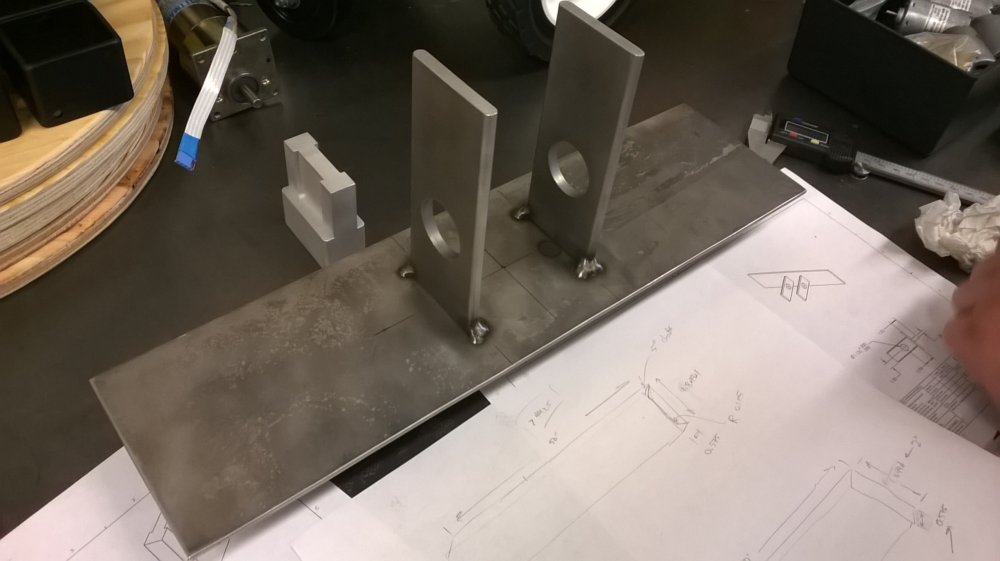
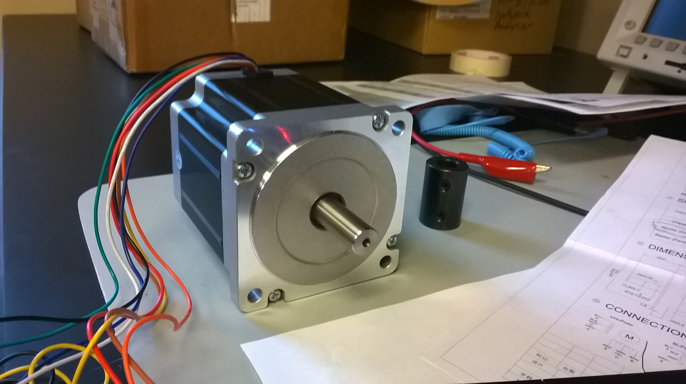
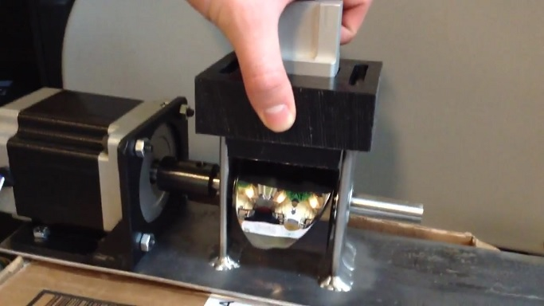

# Arduino Stepper Motor Controller

### About

Arduino 1.6.0 code and experiments to control our NEMA 34 stepper motor with a microcontroller. For our [capstone project at University of Portland](https://engineering.projects.up.edu/ceramicknee/).

### Parts List

- Arduino Mega 2560
  - chosen over an Arduino Uno R3 so we can access pins while LCD keypad shield is attached
- [Nema 34 CNC Stepper Motor](http://www.omc-stepperonline.com/nema-34-cnc-stepper-motor-5nm708ozin-30a-34hs383008s-p-32.html) (most economical source we could find)
- [2M542 Stepper Motor Driver Controller](http://www.sainsmart.com/cnc-2m542-stepper-motor-driver-controller-4-5a-support-nema17-23-34.html)
- [1602 LCD Keypad Shield](http://www.sainsmart.com/sainsmart-1602-lcd-keypad-shield-for-arduino-duemilanove-uno-mega2560-mega1280.html) (generic version purchased off of ebay)
- 24V-50V for motor driver
- USB or 5V Power Supply for Arduino Mega 2560

### Motor Driver Configuration & Wiring

The stepper motor came with 8 exposed wires. So it can be used in Unipolar, Bipolar Series and Bipolar Parallel configurations. Bi-Polar Series seemed like the best option for us, considering the capabilities of our power supply and project outcomes.

#### Pins from Arduion to ST-M5045

- Pul+ goes to +5V
- Pul- goes to Arduino Pin 22
- Dir+ goes to +5V
- Dir- goes to to Arduino Pin 24
- Enable+ to nothing
- Enable- to nothing

#### Microsteps

- We put the driver in 8-microstep mode. We would like to use a greater level of microsteps for more control, but the Arduino cannot pulse quickly enough to maintain the current speed.

### Managing Speed Profile

- There are many options for speed profile. Constant acceleration, constant jerk (s-curve), and so on. AccelStepper library uses constant acceleration.

### Repository Contents

**MotorControllerV1** - Main project

**Early Tests** - Other code used during testing and prototyping.

**Reference** - Spec sheets
